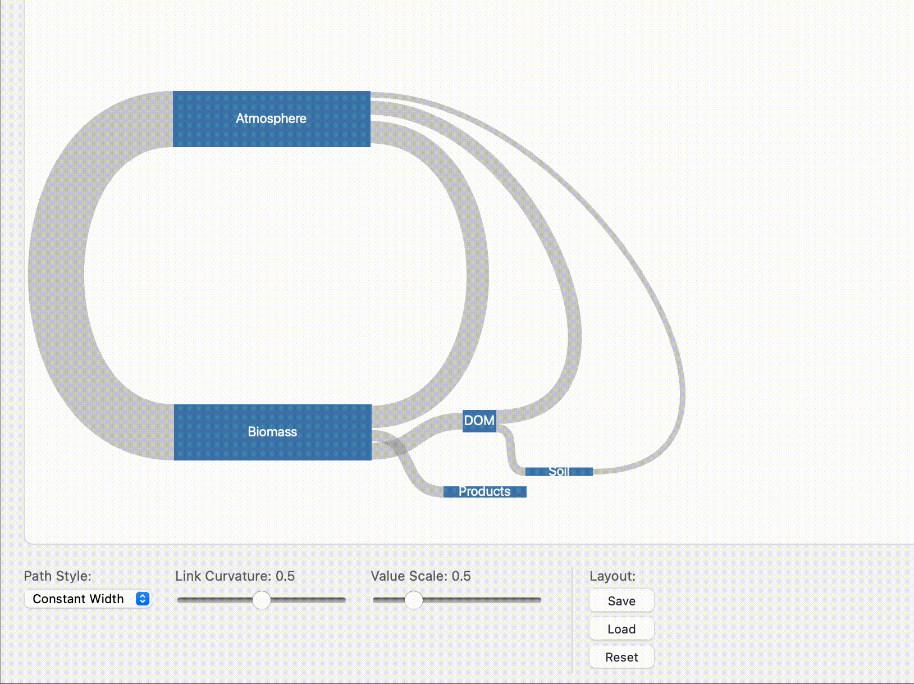

# cbm-sankey

A user-driven layout Sankey diagram library. Design your layout once, reuse it across multiple years of data.

## Features

- **User-driven layout**: Drag nodes, rotate them (0°/90°/180°/270°), and export layouts for reuse
- **Orientation-based flow**: Links enter/exit nodes based on orientation, not fixed directions
- **CSS theming**: Style nodes and links using CSS classes generated from IDs
- **Interactive**: Hover, click, drag, and rotate events
- **Two path styles**: Bezier ribbons or constant-width paths
- **Observable/Quarto compatible**: ESM and UMD builds included



## Installation

```bash
npm install cbm-sankey
```

## Quick Start

```typescript
import { createSankey } from 'cbm-sankey';
import 'cbm-sankey/dist/style.css';

const container = document.getElementById('diagram');

const sankey = createSankey(container, {
  nodes: [
    { id: 'atmosphere', label: 'Atmosphere', x: 100, y: 200, orientation: 0 },
    { id: 'forest', label: 'Forest', x: 300, y: 150, orientation: 0 },
    { id: 'soil', label: 'Soil', x: 300, y: 250, orientation: 0 },
  ],
  links: [
    { id: 'photosynthesis', source: 'atmosphere', target: 'forest', value: 100 },
    { id: 'litterfall', source: 'forest', target: 'soil', value: 30 },
    { id: 'respiration', source: 'soil', target: 'atmosphere', value: 25 },
  ],
  options: {
    valueScale: 0.5,
    curvature: 0.5,
  },
});
```

## API

### `createSankey(container, config)`

Creates a new Sankey diagram.

#### Parameters

- `container: HTMLElement` - The DOM element to render into
- `config.nodes: Node[]` - Array of node definitions
- `config.links: Link[]` - Array of link definitions  
- `config.layout?: Layout` - Optional saved layout to apply
- `config.options?: Partial<SankeyOptions>` - Optional configuration

#### Returns `SankeyInstance`

### Node

```typescript
interface Node {
  id: string;              // Unique identifier
  label?: string;          // Display label
  x: number;               // X position
  y: number;               // Y position
  orientation: 0 | 90 | 180 | 270;  // Rotation in degrees
  length?: number;         // Size along flow axis
}
```

Node orientation determines where links attach:

| Orientation | "In" side | "Out" side |
|-------------|-----------|------------|
| 0° (default) | left | right |
| 90° | top | bottom |
| 180° | right | left |
| 270° | bottom | top |

### Link

```typescript
interface Link {
  id: string;              // Unique identifier
  source: string;          // Source node ID (exits from "out" side)
  target: string;          // Target node ID (enters at "in" side)
  value: number;           // Flow value (determines thickness)
}
```

### SankeyOptions

```typescript
interface SankeyOptions {
  valueScale: number;      // Pixels per unit of flow value (default: 1)
  curvature: number;       // Bezier curvature 0-1 (default: 0.5)
  nodeLength: number;      // Default node length (default: 20)
  pathStyle: 'bezier' | 'constantWidth';  // Path rendering style
}
```

### SankeyInstance Methods

#### Events

```typescript
// Subscribe to events
const unsubscribe = sankey.on('nodeClick', (node) => console.log(node));
sankey.on('nodeHover', (node) => { /* node or null */ });
sankey.on('linkClick', (link) => console.log(link));
sankey.on('linkHover', (link) => { /* link or null */ });
sankey.on('layoutChange', (layout) => { /* save layout */ });

// Unsubscribe
unsubscribe();
```

#### Layout Management

```typescript
// Get current layout (for saving)
const layout = sankey.getLayout();
localStorage.setItem('myLayout', JSON.stringify(layout));

// Apply a saved layout
const savedLayout = JSON.parse(localStorage.getItem('myLayout'));
sankey.setLayout(savedLayout);
```

#### Options

```typescript
// Change options at runtime
sankey.setOption('curvature', 0.7);
sankey.setOption('valueScale', 2);
sankey.setOption('pathStyle', 'constantWidth');

// Get current options
const options = sankey.getOptions();
```

#### Data Updates

```typescript
// Swap to different year's data (layout preserved)
sankey.setData(year2024Nodes, year2024Links);
```

#### Cleanup

```typescript
sankey.destroy();
```

## CSS Styling

Nodes and links get CSS classes based on their IDs:

```css
/* Base styles */
.cbm-sankey .node rect { fill: steelblue; }
.cbm-sankey .link { fill: #999; fill-opacity: 0.5; }

/* Style by node ID */
.cbm-sankey .node--atmosphere rect { fill: #87CEEB; }
.cbm-sankey .node--forest rect { fill: #228B22; }

/* Style by link ID */
.cbm-sankey .link--photosynthesis { fill: #32CD32; }
.cbm-sankey .link--fire { fill: #ff4500; }

/* Hover states */
.cbm-sankey .link:hover { fill-opacity: 0.8; }
.cbm-sankey .node:hover rect { stroke: #333; stroke-width: 2; }
```

IDs are converted to CSS-safe class names: lowercase, spaces and special characters become hyphens.

## Interaction

### Dragging

Drag any node to reposition it. The `layoutChange` event fires when dragging ends.

### Rotating

Double-click a node to rotate it 90° clockwise. This changes which sides links attach to.

## Path Styles

### `bezier` (default)

Traditional Sankey ribbons that taper from source to target thickness.

### `constantWidth`

Paths maintain consistent width along their length. Good for flows where you want to emphasize the magnitude doesn't change.

## Browser Usage (UMD)

```html
<link rel="stylesheet" href="https://unpkg.com/cbm-sankey/dist/style.css">
<script src="https://unpkg.com/cbm-sankey/dist/cbm-sankey.umd.cjs"></script>
<script>
  const sankey = CbmSankey.createSankey(container, { nodes, links });
</script>
```

## Observable Notebooks

```javascript
CbmSankey = require("cbm-sankey")

viewof diagram = {
  const container = html`<div style="width: 800px; height: 600px;"></div>`;
  const sankey = CbmSankey.createSankey(container, { nodes, links });
  return container;
}
```

## License

MIT
